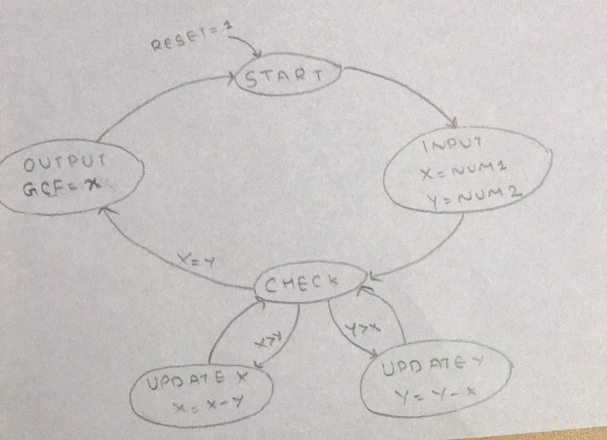

# GCD FSM

This VHDL code implements a Finite State Machine (FSM) to calculate the Greatest Common Divisor (GCD) of two integers.

## Description

The FSM has the following states:
- **START**: Initializes the GCD to 10 and transitions to the INPUT state.
- **INPUT**: Assigns the input numbers to variables `x` and `y` and calculates `z = x * y`, then transitions to the CHECK state.
- **CHECK**: Compares `x` and `y` and transitions to UPDATEX, UPDATEY, or OUTPUT state accordingly.
- **UPDATEX**: Updates `x = x - y` and transitions back to the CHECK state.
- **UPDATEY**: Updates `y = y - x` and transitions back to the CHECK state.
- **OUTPUT**: Calculates the GCD using the Euclidean algorithm and transitions back to the START state.

## Inputs
- `reset`: Asynchronous reset input.
- `clk`: Clock input.
- `num1`: First input number.
- `num2`: Second input number.

## Outputs
- `gcd`: Output of the GCD calculation.

  ## FSM

